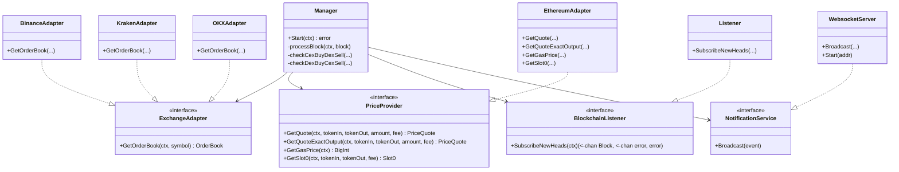

# CEX-DEX Arbitrage Bot (ETH/USDC)

This project implements a production-grade, real-time arbitrage detection bot for the ETH/USDC pair, comparing prices between Binance (CEX) and Uniswap V3 (DEX).

## 🏗 Architecture Decisions

The project follows **Hexagonal Architecture (Ports & Adapters)** to ensure separation of concerns, testability, and maintainability.

### 1. Domain-Centric Design
- **`internal/core/domain`**: Contains pure business logic and data structures (`OrderBook`, `ArbitrageOpportunity`). It has zero dependencies on external libraries or implementations.
- **`internal/core/ports`**: Defines interfaces (`ExchangeAdapter`, `PriceProvider`) that the core logic uses. This allows us to swap Binance for Coinbase or Uniswap for SushiSwap without touching the core logic.

### 2. Concurrency & Worker Pools
- **Why?**: Ethereum blocks arrive every ~12 seconds, but network latency or API rate limits could cause processing to take longer.
- **Implementation**: We use a **Worker Pool** pattern (via a buffered channel semaphore) in the `Manager`.
- **Decision**: If the worker pool is full (processing is lagging), we **drop** the new block rather than queuing it indefinitely. In arbitrage, stale data is useless. It is better to skip a block than to process old prices.

### 3. Block-Driven vs. Event-Driven
- **Decision**: We use a **Block-Driven** approach (listening for `newHeads`).
- **Reasoning**:
    1.  **Atomic Consistency**: Fetching CEX and DEX prices at the specific block height ensures we are comparing data from the same "moment" in chain time.
    2.  **Simplicity**: Listening for specific Swap events is complex and can miss state changes caused by liquidity provisioning. Re-quoting on every block guarantees the current state.

### 4. Precision Math
- **Library**: `github.com/shopspring/decimal` and `math/big`.
- **Why?**: Floating-point arithmetic (`float64`) introduces rounding errors that are unacceptable in financial calculations. We use `decimal` for all price/profit calculations and `big.Int` for raw blockchain values (Wei).

### 5. Effective Price (Slippage)
- **Problem**: The "mid-market" price is misleading for large trades. A 100 ETH sell order will eat through the order book, resulting in a worse execution price.
- **Solution**:
    - **CEX**: We fetch depth=100 and "walk" the order book to calculate the weighted average price for the specific trade size.
    - **DEX**: We use Uniswap's `QuoterV2` contract, which simulates the swap on-chain and returns the exact output amount accounting for pool liquidity and tick distribution.

### 6. Resiliency
- **WebSocket Reconnection**: The `BlockchainListener` implements exponential backoff to handle connection drops gracefully.
- **Graceful Shutdown**: The application listens for `SIGINT`/`SIGTERM` to close connections and finish in-flight tasks before exiting, preventing corrupted state or hung connections.

### 7. Gas Modeling (Net Profit)
- **Problem**: Gross profit is misleading because Ethereum gas fees can eat up margins.
- **Solution**:
    - **Dynamic Gas Price**: We fetch the current gas price from the network (using `eth_gasPrice` or `SuggestGasPrice`).
    - **Net Profit Calculation**: `Net Profit = Gross Profit - (Gas Estimate * Gas Price)`.
    - **UI**: The dashboard displays a breakdown of Gross Profit, Gas Cost, and Net Profit.

### 8. Trade-offs
"Decidí usar el QuoterV2 de Uniswap para mayor precisión matemática en la estimación de swaps, sacrificando la latencia mínima que daría un cálculo local de ticks, priorizando la fiabilidad de la detección."

## 🚀 Setup & Usage

### Prerequisites
- Go 1.21+
- Ethereum Node URL (Infura/Alchemy) - WebSocket (WSS) and HTTP.

### Configuration
Set the following environment variables (or rely on defaults in `cmd/bot/main.go`):

```bash
export ETH_NODE_WS="wss://mainnet.infura.io/ws/v3/YOUR_KEY"
export ETH_NODE_HTTP="https://mainnet.infura.io/v3/YOUR_KEY"
export TRADE_SIZES="1000000000000000000,10000000000000000000" # 1 ETH, 10 ETH (in Wei)
```

### Running
```bash
go run cmd/bot/main.go
```

### Docker (Recommended)

Run the bot and Prometheus with a single command:

```bash
# Export your keys first
export ETH_NODE_WS="wss://..."
export ETH_NODE_HTTP="https://..."

# Start services
docker-compose up --build -d
```

- **Bot Metrics**: `http://localhost:9090/metrics`
- **Prometheus UI**: `http://localhost:9091`
- **Dashboard**: `http://localhost:3000`

### Dashboard (Local Development)
The dashboard is a Next.js application located in the `dashboard/` directory.

```bash
cd dashboard
npm install
npm run dev
```
Access at `http://localhost:3000`.

## 📂 Project Structure

```
├── cmd
│   └── bot             # Main entry point
├── internal
│   ├── adapters        # External implementations
│   │   ├── binance     # CEX Adapter (REST)
│   │   ├── blockchain  # Ethereum Listener (WS)
│   │   └── ethereum    # DEX Adapter (RPC/Quoter)
│   └── core
│       ├── domain      # Business entities
│       ├── ports       # Interfaces
│       └── services    # Business logic (Manager)
```

## 📊 Class Diagram




## 🏗 Architecture Diagram

```mermaid
graph TD
    subgraph External Systems
        ETH[Ethereum Node]
        CEX[CEX API (Binance/Kraken/OKX)]
        DEX[Uniswap V3 Quoter]
    end

    subgraph Core
        L[Blockchain Listener]
        M[Manager]
        EA[Exchange Adapter]
        DA[DEX Adapter]
        PC[Profit Calculator]
    end

    subgraph Output
        NS[Notification Service]
        WS[WebSocket Server]
        DB[Dashboard UI]
    end

    ETH -->|New Block Headers| L
    L -->|Block Channel| M
    M -->|Fetch OrderBook| EA
    EA -->|HTTP REST| CEX
    M -->|Fetch Quote/Gas| DA
    DA -->|RPC Call| DEX
    
    EA -->|OrderBook Data| M
    DA -->|Price Quote| M
    
    M -->|Data| PC
    PC -->|Arbitrage Opportunity| M
    
    M -->|Broadcast Event| NS
    NS -->|Push JSON| WS
    WS -->|WebSocket| DB
```
