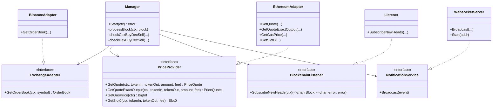

# CEX-DEX Arbitrage Bot (ETH/USDC)

## Project Overview
This project implements a production-grade, real-time arbitrage detection bot for the ETH/USDC pair, comparing prices between Binance (CEX) and Uniswap V3 (DEX). It is designed to be robust, accurate, and performant, following Hexagonal Architecture principles.

## 🏗 Architecture Diagram

```mermaid
graph TD
    subgraph External Systems
        ETH[Ethereum Node]
        CEX[CEX API (Binance/Kraken/OKX)]
        DEX[Uniswap V3 Quoter]
    end

    subgraph Core
        L[Blockchain Listener]
        M[Manager]
        EA[Exchange Adapter]
        DA[DEX Adapter]
        PC[Profit Calculator]
    end

    subgraph Output
        NS[Notification Service]
        WS[WebSocket Server]
        DB[Dashboard UI]
    end

    ETH -->|New Block Headers| L
    L -->|Block Channel| M
    M -->|Fetch OrderBook| EA
    EA -->|HTTP REST| CEX
    M -->|Fetch Quote/Gas| DA
    DA -->|RPC Call| DEX
    
    EA -->|OrderBook Data| M
    DA -->|Price Quote| M
    
    M -->|Data| PC
    PC -->|Arbitrage Opportunity| M
    
    M -->|Broadcast Event| NS
    NS -->|Push JSON| WS
    WS -->|WebSocket| DB
```

## 💡 Key Technical Decisions

### 1. Go (Concurrency)
We chose Go for its superior concurrency primitives. The bot uses a **Worker Pool** pattern to handle block processing.
- **Why?**: Ethereum blocks arrive every ~12 seconds. If API calls hang, we don't want to block the entire pipeline.
- **Mechanism**: A buffered channel acts as a semaphore. If the pool is full, we drop the block rather than queuing it, ensuring we always process fresh data.

### 2. WebSockets (Latency)
The bot uses a **Block-Driven** approach via WebSockets (`newHeads` subscription).
- **Why?**: Polling is too slow. WebSockets provide real-time notification of new blocks.
- **Consistency**: By triggering logic on every new block, we ensure we are comparing CEX prices against a specific, immutable state of the blockchain (the block height), guaranteeing atomic consistency for the arbitrage calculation.

### 3. QuoterV2 (Precision)
We use Uniswap's **QuoterV2** contract for on-chain price simulation.
- **Why?**: Local tick calculation is faster but complex and prone to synchronization errors.
- **Trade-off**: "Decidí usar el QuoterV2 de Uniswap para mayor precisión matemática en la estimación de swaps, sacrificando la latencia mínima que daría un cálculo local de ticks, priorizando la fiabilidad de la detección."

### 4. Precision Math
- **Library**: `github.com/shopspring/decimal` and `math/big`.
- **Why?**: Floating-point arithmetic (`float64`) introduces rounding errors that are unacceptable in financial calculations. We use `decimal` for all price/profit calculations and `big.Int` for raw blockchain values (Wei).

### 5. Effective Price (Slippage)
- **Problem**: The "mid-market" price is misleading for large trades. A 100 ETH sell order will eat through the order book, resulting in a worse execution price.
- **Solution**:
    - **CEX**: We fetch depth=100 and "walk" the order book to calculate the weighted average price for the specific trade size.
    - **DEX**: We use Uniswap's `QuoterV2` contract, which simulates the swap on-chain and returns the exact output amount accounting for pool liquidity and tick distribution.

### 6. Gas Modeling (Net Profit)
- **Problem**: Gross profit is misleading because Ethereum gas fees can eat up margins.
- **Solution**:
    - **Dynamic Gas Price**: We fetch the current gas price from the network (using `eth_gasPrice` or `SuggestGasPrice`).
    - **Net Profit Calculation**: `Net Profit = Gross Profit - (Gas Estimate * Gas Price)`.

### 7. Resiliency
- **WebSocket Reconnection**: The `BlockchainListener` implements exponential backoff to handle connection drops gracefully.
- **Graceful Shutdown**: The application listens for `SIGINT`/`SIGTERM` to close connections and finish in-flight tasks before exiting, preventing corrupted state or hung connections.

## 🚀 How to Run

### Prerequisites
- **Go 1.21+**
- **Ethereum Node**: You **MUST** have an API Key from a provider like **Alchemy** or **Infura**.

### Configuration
Set the following environment variables. You can create a `.env` file based on `.env.example`.

```bash
# REQUIRED: Your Ethereum Node URLs (Alchemy/Infura)
export ETH_NODE_WS="wss://eth-mainnet.g.alchemy.com/v2/YOUR_API_KEY"
export ETH_NODE_HTTP="https://eth-mainnet.g.alchemy.com/v2/YOUR_API_KEY"

# Optional: Trade sizes in Wei (default: 1 ETH)
export TRADE_SIZES="1000000000000000000"
```

### Running the Bot
```bash
go run cmd/bot/main.go
```

### Docker (Recommended)
Run the bot and Prometheus with a single command:

```bash
# Export your keys first
export ETH_NODE_WS="wss://..."
export ETH_NODE_HTTP="https://..."

# Start services
docker-compose up --build -d
```

- **Bot Metrics**: `http://localhost:9090/metrics`
- **Prometheus UI**: `http://localhost:9091`
- **Dashboard**: `http://localhost:3000`

### Running the Dashboard (Local)
```bash
cd dashboard
npm install
npm run dev
```
Access at `http://localhost:3000`.

### Testing
```bash
go test ./...
```

## 📂 Project Structure

```
├── cmd
│   └── bot             # Main entry point (main.go)
├── internal
│   ├── adapters        # External implementations (Binance, Ethereum, WebSocket)
│   ├── core            # Pure business logic (Hexagonal Architecture)
│   │   ├── domain      # Entities (OrderBook, ArbitrageOpportunity)
│   │   ├── ports       # Interfaces (ExchangeAdapter, PriceProvider)
│   │   └── services    # Application logic (Manager)
│   └── engine          # Bootstrap and lifecycle management
├── dashboard           # Next.js Frontend
└── tests               # Integration tests
```

## 📊 Appendix: Class Diagram


